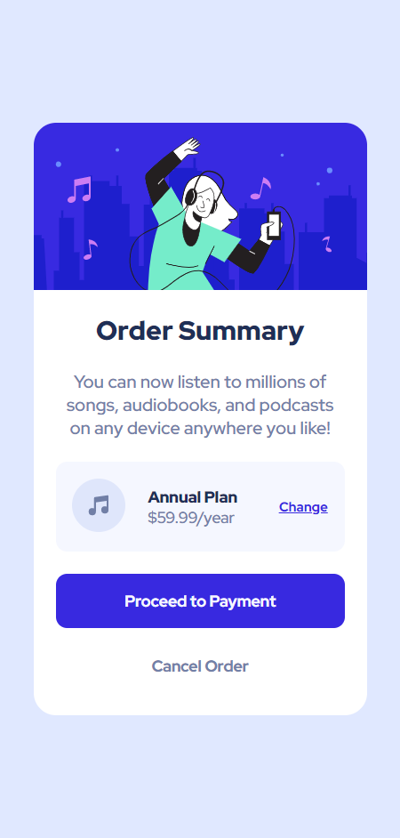

# Frontend Mentor - Order summary card solution

This is a solution to the [Order summary card challenge on Frontend Mentor](https://www.frontendmentor.io/challenges/order-summary-component-QlPmajDUj). Frontend Mentor challenges help you improve your coding skills by building realistic projects. 

## Table of contents

- [Overview](#overview)
  - [The challenge](#the-challenge)
  - [Screenshot](#screenshot)
  - [Links](#links)
- [Author](#author)

## Overview

### The challenge

Users should be able to:

- See hover states for interactive elements

### Screenshot

### Links

- Solution URL: [https://github.com/lcabrera13/order-summary-card-solution.git](https://github.com/lcabrera13/order-summary-card-solution.git)
- Live Site URL: [https://order-summary-card-solution-six.vercel.app](https://order-summary-card-solution-six.vercel.app)

## Author

- Website - [Luis Cabrera](https://lcabrera13.github.io/)
- Frontend Mentor - [@lcabrera13](https://www.frontendmentor.io/profile/lcabrera13)
- GitHub - [@lcabrera13](https://github.com/lcabrera13)